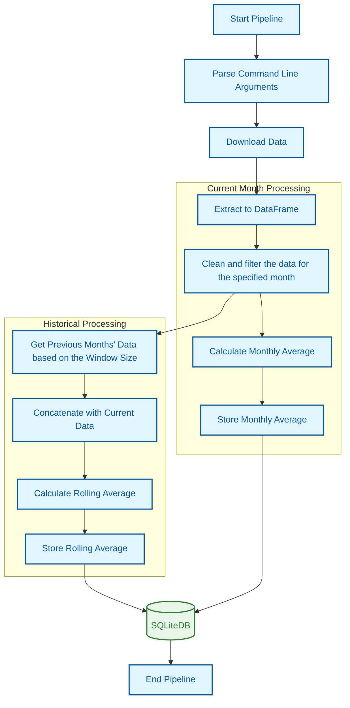

# NYC Yellow Taxi Data Pipeline

This project implements a data pipeline to process and analyze NYC Yellow Taxi trip data, including downloading, extracting, transforming, and storing data. It computes monthly and rolling averages for taxi trip lengths and stores the results in a local SQLite database.

## Table of Contents

- [Prerequisites](#prerequisites)
- [How to Run the Pipeline](#how-to-run-the-pipeline)
- [Arguments](#arguments)
- [Data Pipeline Steps](#data-pipeline-steps)
- [Functionality](#functionality)
- [Running Tests Locally](#running-tests-locally)
- [Storing Results in Database](#storing-results-in-database)
- [Scaling the Pipeline](#scaling-the-pipeline)
- [Conclusion](#conclusion)

## Prerequisites

Ensure the following are installed:

- Python 3.11 or higher
- SQLite (for local database usage)

## How to Run the Pipeline

1. **Clone the Repository:**

     ```sh
        git clone <repository-url>
        cd <repository-directory>
        ``` 

2. **Set Up Virtual Environment:**

     ```sh
        python -m venv .venv
        source .venv/bin/activate  # On Windows use .venv\Scripts\activate`
        ``` 

3. **Install Dependencies:**

     ```sh
        pip install -r requirements.txt
        ``` 

4. **Run the pipeline:**

    Specify the year and month of the data to process. The window size for the rolling average is optional and defaults to 10 days.

    ```sh
    python pipeline.py --year 2024 --month 02
    ```

    Example with custom rolling window and database name:

    ```sh
    python pipeline.py --year 2024 --month 02 --window-size 45 --db-name sqlitedb
    ```

## Arguments

| Argument        | Description                                       | Required | Default Value  |
| --------------- | ------------------------------------------------  | -------- | -------------- |
| `--year`        | Year of the data to process                       | Yes      | N/A            |
| `--month`       | Month of the data to process                      | Yes      | N/A            |
| `--window-size` | Window size for calculating rolling averages      | No       | 10             |
| `--db-name`     | Name of the database to store results             | No       | sqlitedb       |

## Data Pipeline Steps

- **Download Data:** Downloads taxi trip data for the specified year and month.
- **Extract Data:** Loads raw data into a pandas DataFrame for processing.
- **Data Cleaning:** Cleans the data and handles invalid or missing records.
- **Monthly Average Calculation:** Computes the average trip length for the specified month.
- **Store Monthly Average:** Saves the calculated averages in the table monthly_avg_trip_length.
- **Retrieve Previous Months' Data:** Retrieves data for previous months to calculate the rolling average.
- **Calculate Rolling Average:** Computes rolling averages of trip lengths over the selected window size.
- **Store Rolling Average:** Stores the rolling average data in the table yellow_taxi_data.

## Functionality

Below is a high-level flowchart representing the data pipeline process:



## Running Tests Locally

To run the pipeline locally, you can use the test script located in `tests/test_pipeline.py`

1. **Install Test Dependencies:**

    ```sh
    pip install -r tests/requirements-dev.txt
    ```

2. **Run Tests:**

    ```sh
    pytest tests/test_pipeline.py -s
    ```

3. **After running the tests, you should see the downloaded `.parquet` files in the `tests/data/input` directory**

## Storing Results in Database

1. ### Database Insertion Behavior

    The pipeline uses the `df.to_sql()` function to insert data into the database. The parameter `if_exists='replace'` is used to specify that if a table with the same name already exists, it will be **replaced** with the new data.

    **Note**: This approach will overwrite any existing data in the specified table each time the pipeline runs. If you need to keep historical data, consider changing `if_exists='replace'` to `if_exists='append'` in the code.

2. ### Database Tables

    The pipeline stores its results in an SQLite database with the following tables:

    1. `monthly_avg_trip_length:`

        - Stores the average trip length for each month.
        - Fields:
            - **year:** Year of the data
            - **month:** Month of the data
            - **monthly_average:** Monthly average trip length

    2. `yellow_taxi_data:`

        - Stores the rolling averages for taxi trips over a specified window of months.
        - Fields:
            - **tpep_pickup_datetime:** Start date and time of the trip
            - **tpep_dropoff_datetime:** End date and time of the trip
            - **trip_distance:** Total distance of the trip
            - **trip_duration:** Total duration of the trip
            - **rolling_avg_distance:** Rolling average of trip lengths over the window

3. ### Viewing the Contents of the Database Table

    To inspect the data stored in the database, you can run a query to load the contents of a specific table into a pandas DataFrame.

    1. **Connect to the Database**: Establish a connection to the SQLite database file.
    2. **Execute a Query**: Use SQL to retrieve all records from a table and load them into a DataFrame for inspection.

    Here's an example code snippet to view the contents of the `yellow_taxi_data` table:

    ```python
    import sqlite3
    import pandas as pd

    # Connect to the SQLite database
    db_name = 'sqlitedb'  # Replace with your database file name
    conn = sqlite3.connect(db_name)

    # Execute a SQL query to read data from the table
    query = 'SELECT * FROM yellow_taxi_data'  # Replace with your table name
    df = pd.read_sql_query(query, conn)

    # Display the DataFrame contents
    print(df)

    # Close the database connection
    conn.close()
    ```

    **Note:** Ensure db_name matches the name of your database file. Running this code will load and display the entire table, so for large tables, consider limiting rows with a query like SELECT * FROM table_name LIMIT 10.

## Scaling The Pipeline

As data size increases and can no longer fit on a single machine, the following strategies can be used to scale the pipeline:

1. ### Distributed Processing

    - **Frameworks:** Use distributed data processing frameworks such as Apache Spark or Dask that can handle large datasets by distributing processing tasks across a cluster of machines.
    - **Parallelization:** Split the data by months, years, or other logical partitions, and process each partition in parallel across multiple nodes.
    - **Adaptation:** Refactor the existing pandas-based operations into distributed equivalents, such as using Spark DataFrames for extraction, transformation, and aggregation tasks.

2. ### Data Storage with Distributed File Systems

    - **HDFS (Hadoop Distributed File System):** Store large datasets in distributed storage solutions like HDFS or Amazon S3, allowing the pipeline to pull and process data from distributed sources.
    - **Cloud Storage:** For massive data volumes, cloud-based storage services such as Amazon S3 or Google Cloud Storage can be used to store and retrieve data efficiently.

3. ### Horizontal Scaling

    - **Horizontal Autoscaling:** For cloud deployments, use horizontal autoscaling to automatically add or remove compute resources based on load. Services like AWS Lambda (serverless) or Kubernetes can be configured to scale horizontally based on demand.

## Conclusion

By using distributed frameworks like Spark or Dask, along with cloud storage and horizontal scaling, the pipeline can be scaled efficiently to handle increasing volumes of NYC Yellow Taxi data or other large datasets.
